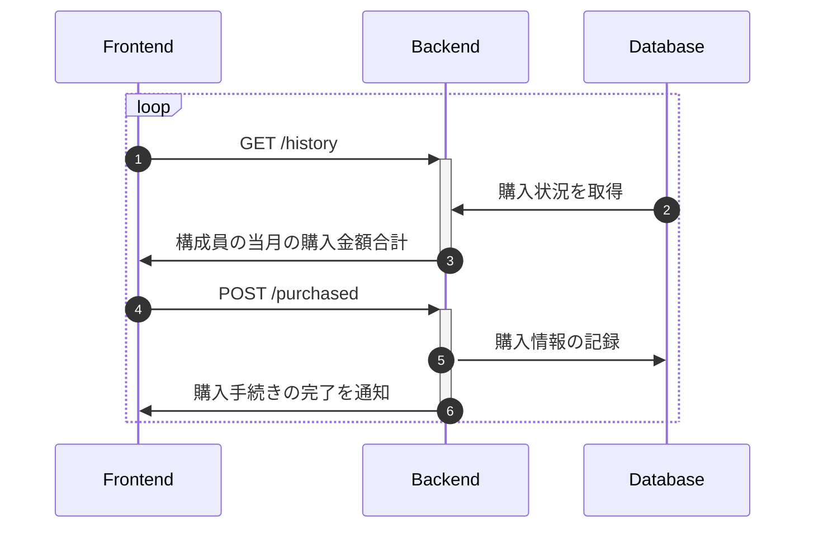
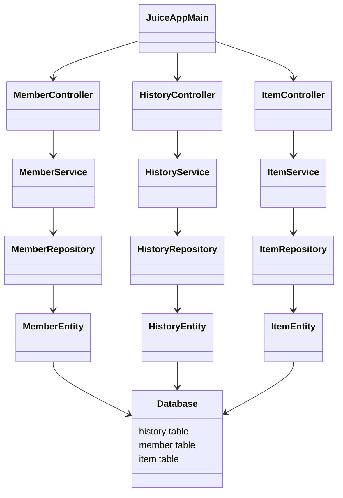

会計アプリのバックエンドです．

# HOW TO USE
```
git clone https://github.com/Haur514/JuiceApp_backend.git
cd JuiceApp_backend
docker-compose up -d
rm ./dbdata/.gitkeep
docker exec -it postgresql bash /docker-entrypoint-initdb.d/00_init-script.sh 
./gradlew bootRun
```
[localhost:5050](http://localhost:5050)にアクセスすれば利用できます．

各種テーブルが作成されていない場合，以下を実行してください．初期passwordはpassです．
```
psql -h 127.0.0.1 -p 5433 -U admin test-db -f ./script/init/init-item.sql
psql -h 127.0.0.1 -p 5433 -U admin test-db -f ./script/init/init-history.sql
psql -h 127.0.0.1 -p 5433 -U admin test-db -f ./script/init/init-member.sql
```

## 開発メモ
docker-compose.ymlを書き換えた時は，以下コマンドを実行すると良いかも．
コンテナの作成時に1度だけ実行されるスクリプトとかがあるから．
```
docker-compose down -v
```


## 各種API
### GET
#### 購入履歴管理周り
* 購入履歴の取得
```
/history?
    [name=hoge]
```
ユーザが未指定の場合，最大30件の直近の購入履歴をJSON形式で返す．

#### 商品管理周り
* 商品のリストを取得
```
/item?
    [group = juice/ice/...]
    
```

#### ユーザ管理周り
* ユーザの表示
```
/member?
    [name=hoge]
    [attribute=m1,m2,..]
```

* 当月のユーザの使用金額ランキング
```
/member/ranking
```
* 未払い金があるユーザの一覧取得
```
/member/unpayed
```

#### 各月の売り上げ取得
* 現在の時刻を取得し，そこから過去1年分のデータを取得
```
/history/eachmonth
```
### POST
#### ユーザ管理周り

* ユーザの登録
```
/member/add?
    name=hoge&
    displayName=huga
    attribute=m1/m2/teacher,...
```
nameは`h-yosiok`のような識別子
dispayNameは表示用の名前
* ユーザの削除
```
/member/delete?
    name=hoge
```

* ユーザの更新
```
/member/update?
    [name=hoge]
    [displayName=huga]
    [attribute=m1,m2,...]
```

#### 購入履歴管理周り

* 購入情報の記録
```
/history/add?
    name=hoge&
    item=juice&
    price=100
```

* 購入ランキングの取得
```
/history/ranking
```
JSON形式でランキングを返す．
* 購入記録の取り消し
```
/history/delete?
    name=hoge&
    id=2
```
商品のキャンセル．
idがprimary keyだが，念の為ユーザも指定しておくこと．

<!-- * 購入記録が取り消せるかの確認
```
/cancelable?
    user
    id
``` -->

#### 商品管理周り
* 商品の追加
```
/item/add?
    name=cora&
    sellingprice=100&
    costprice=80&
    group=juice
```
salesfigureは売上．登録時点では売上は0なので，指定しない．
* 商品の削除
```
/item/delete?
    name=cora
```
* 商品の更新
```
/item/update?
    name=cora&
    [sellingprice=100&]
    [costprice=80&]
    [group=juice&]
    [salesfigure=10]
```

## 想定するシーケンス図


## CLASS図


## データベース構成
### history
|id|name|item|price|date|
|---|---|---|---|---|
|1|h-yosiok|A group juice|80|2022/07/23/20:03|
|2|tk-iwase|A group juice|80|2022/07/23/20:03|]

### member
|name|displayname|unpayedamount|
|---|---|---|
|h-yosiok|ほげふが|100|

### item
|name|sellingprice|costprice|grouping|salesfigure|
|---|---|---|---|---|
|cocacora|80|70|juice|22|
|orange|70|60|juice|55|

salesfigure: 購入された個数
